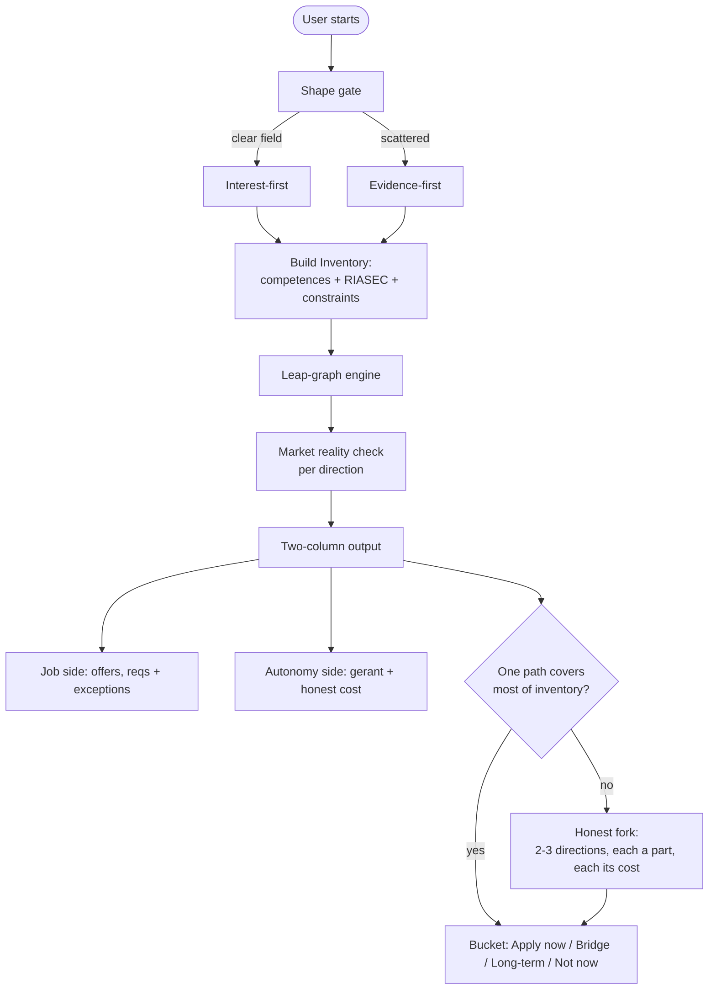
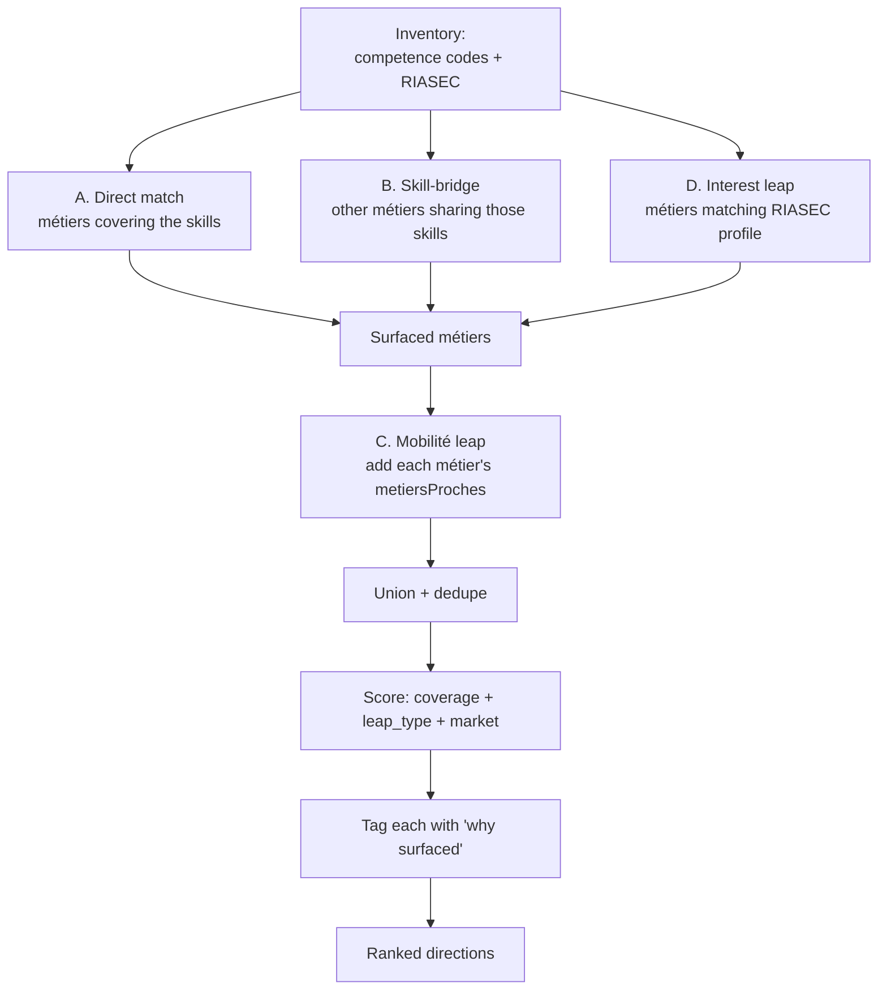
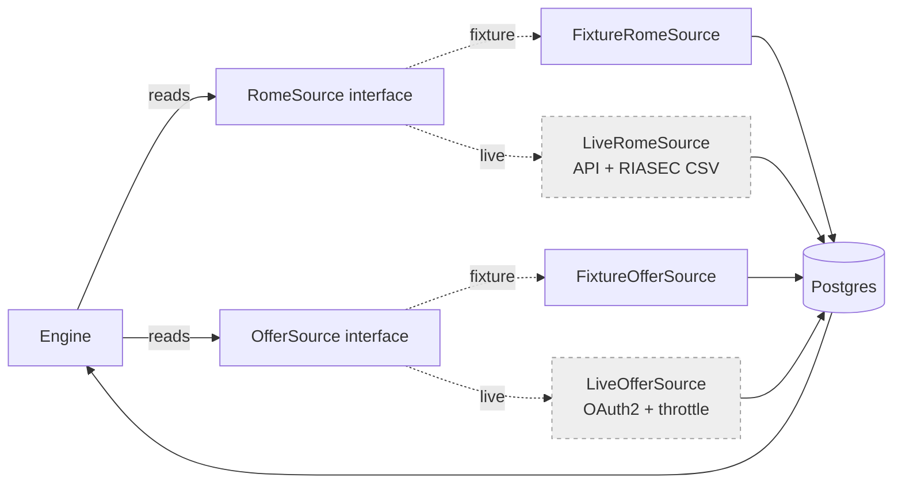
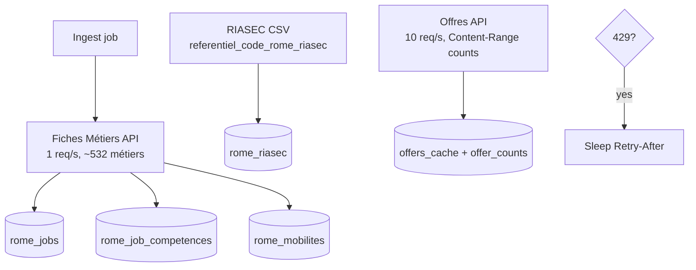

# Flow Sheets — Career Engine

Render at mermaid.live. Four flows: user journey, leap-graph engine, data seams, live ingestion.

---

## 1. User journey

---

## 2. Leap-graph engine (the differentiator)

Gate: skill-bridge (B) and mobilité (C) must surface directions the user would NOT have named. If only direct (A) appears, stop and report.

---

## 3. Data seams (fixture now, live later)

Plus a Phase-2 seam: `DirectionProposer` = GraphDirectionProposer (default) | LlmDirectionProposer (dormant, Haiku, separate API key + spend cap).

---

## 4. Live ROME ingestion (dormant until credentials)

RIASEC is CSV-only — never an API call.
